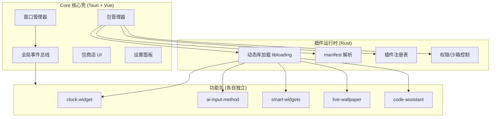

### **一套基于 Tauri + Vue + Vite + Rust 的 Core + 插件包桌面美化套件，核心是自建的轻量插件运行时（Rust 动态加载 + Vue 异步组件），MVP 阶段先做透明 Dock + 时钟 Widget 跑通包加载链路。**

基于前面讨论的架构，我把这个项目命名为 **"Desktop Suite"（暂定）**，下面是完整的项目规划与结构清单。

---

## **项目定位**

做一个**桌面增强套件**，不是操作系统 Shell 替换。它由一个最小化的 Core（壳层）和若干可独立安装、卸载、更新的功能包组成。Core 只负责窗口管理、包管理、全局事件总线这三件最基础的事，所有「美化能力」全部下沉到插件包里——时钟、输入法、动态壁纸、小组件、代码助手都是平等的包。

这套设计的好处是：Core 体积小、启动快、职责单一；功能按需获取，用户不装就完全不占资源；你自己开发时也能把每个包当成独立小项目迭代，互不阻塞。

---

## **技术栈确认**

| 层级 | 技术 | 用途 |
|------|------|------|
| 壳层 | Tauri 2.x | 跨窗口、系统集成、IPC |
| 前端 | Vue 3 + Vite + Pinia | UI 渲染、状态管理、动态组件 |
| 后端 | Rust | Core 逻辑、插件加载、系统调用 |
| 插件后端 | Rust（编译为 .dll/.so/.dylib） | 动态库，由 Core 用 `libloading` 加载 |
| 插件前端 | Vue 组件 | 由 Core 用异步组件动态挂载 |
| 包管理 | 自定义 manifest + GitHub 仓库索引 | 安装/卸载/更新 |

---

## **架构总览**



核心原则：**Core 不内置任何美化功能**。时钟都是个包。这样能强迫你把插件接口设计得足够通用，避免「特权内置包」破坏架构纯净性。

---

## **完整目录结构清单**

采用 monorepo 结构，一个仓库管 Core、SDK、所有官方包。

### **顶层结构**

```
desktop-suite/                          # 项目根目录（monorepo / pnpm workspace）
├── apps/
│   └── core/                           # ① Core 主应用
├── packages/                           # ② 官方插件包集合
│   ├── clock-widget/
│   ├── ai-input-method/
│   ├── smart-widgets/
│   ├── live-wallpaper/
│   └── code-assistant/
├── sdk/                                # ③ 插件开发 SDK
│   ├── plugin-sdk-rs/                  # Rust 端 SDK（trait + 宏）
│   └── plugin-sdk-vue/                 # Vue 端 SDK（加载器封装 + 类型）
├── docs/                               # ④ 文档
├── scripts/                            # ⑤ 构建/打包脚本
├── registry/                           # ⑥ 包商店索引仓库（可独立成 repo）
├── pnpm-workspace.yaml
├── package.json                        # monorepo 根配置
└── README.md
```

### **① Core 主应用结构**

这是项目的核心，分 Rust 后端和 Vue 前端两块。

```
apps/core/
├── src-tauri/                          # Rust 后端
│   ├── src/
│   │   ├── main.rs                     # 入口
│   │   ├── lib.rs                      # 模块声明
│   │   ├── commands/                   # Tauri Command（暴露给前端）
│   │   │   ├── mod.rs
│   │   │   ├── window.rs               # 窗口创建/移动/置顶/穿透
│   │   │   ├── system.rs               # CPU/内存/进程信息
│   │   │   ├── package.rs              # 包安装/卸载/列表
│   │   │   └── config.rs               # 配置读写
│   │   ├── core/                       # 核心服务层
│   │   │   ├── mod.rs
│   │   │   ├── event_bus.rs            # 全局事件总线（emit/listen）
│   │   │   ├── window_mgr.rs           # 多窗口生命周期管理
│   │   │   ├── config.rs               # 配置持久化（JSON）
│   │   │   └── autostart.rs            # 开机自启
│   │   ├── plugin/                     # ★ 插件运行时（重点）
│   │   │   ├── mod.rs
│   │   │   ├── loader.rs               # libloading 动态库加载
│   │   │   ├── manifest.rs             # manifest.json 解析与校验
│   │   │   ├── registry.rs             # 已加载插件注册表
│   │   │   ├── permissions.rs          # 权限声明与校验
│   │   │   ├── lifecycle.rs            # install/enable/disable/uninstall
│   │   │   └── asset_server.rs         # 为插件前端提供静态资源 serve
│   │   ├── store/                      # 包商店后端
│   │   │   ├── mod.rs
│   │   │   ├── registry_client.rs      # 拉取远程包索引
│   │   │   ├── downloader.rs           # 下载 + 校验签名
│   │   │   └── extractor.rs            # 解压到本地 packages 目录
│   │   └── traits.rs                   # ★ PluginTrait 定义（FFI 契约）
│   ├── Cargo.toml
│   ├── tauri.conf.json                 # 窗口配置（dock/widget 预设）
│   └── build.rs
│
├── src/                                # Vue 前端
│   ├── main.ts                         # 入口
│   ├── App.vue
│   ├── windows/                        # ★ 多窗口入口（每个一个 Vue 应用）
│   │   ├── dock.ts                     # Dock 窗口入口
│   │   ├── widgetHost.ts               # Widget 容器窗口入口
│   │   ├── packageStore.ts             # 包商店窗口入口
│   │   └── settings.ts                 # 设置窗口入口
│   ├── views/
│   │   ├── DockView.vue
│   │   ├── WidgetHostView.vue
│   │   ├── PackageStoreView.vue
│   │   └── SettingsView.vue
│   ├── components/
│   │   ├── Dock/                       # Dock 图标、动画、拖拽
│   │   │   ├── DockBar.vue
│   │   │   ├── DockItem.vue
│   │   │   └── DockMagnify.ts          # 放大镜效果（CSS transform）
│   │   ├── Widgets/
│   │   │   └── WidgetSlot.vue          # 动态挂载插件前端组件的容器
│   │   ├── Store/
│   │   │   ├── PackageCard.vue
│   │   │   └── InstallDialog.vue
│   │   └── Shared/                     # 毛玻璃面板、图标按钮等
│   ├── composables/                    # 组合式函数
│   │   ├── usePackage.ts               # 调用包管理 Command
│   │   ├── useWindow.ts                # 窗口控制封装
│   │   ├── useRustCommand.ts           # invoke 类型封装
│   │   └── usePluginFrontend.ts        # ★ 动态加载插件 Vue 组件
│   ├── stores/                         # Pinia（跨窗口状态）
│   │   ├── packages.ts                 # 已安装/已启用包状态
│   │   ├── windows.ts                  # 窗口布局状态
│   │   └── settings.ts
│   ├── router/
│   ├── types/
│   │   ├── manifest.ts                 # manifest 的 TS 类型
│   │   └── plugin.ts                   # 插件接口类型
│   └── assets/
│
├── vite.config.ts                      # 多入口构建配置
├── tsconfig.json
└── package.json
```

### **② 插件包标准结构**

每个包都遵循同一套目录约定。以智能输入法为例：

```
packages/ai-input-method/
├── manifest.json                       # ★ 包身份证（必需）
├── backend/                            # Rust 后端（可缺省=纯前端包）
│   ├── src/
│   │   ├── lib.rs                      # 实现 PluginTrait + 导出 _plugin_init
│   │   └── ime/                        # 输入法核心逻辑
│   │       ├── engine.rs               # 拼音切分、候选词排序
│   │       ├── dict.rs                 # 词库加载与查询
│   │       └── predictor.rs            # AI 预测模型推理
│   ├── Cargo.toml                      # 依赖 plugin-sdk-rs
│   └── build.rs                        # 编译为 cdylib
├── frontend/                           # Vue 前端（可缺省=纯后端包）
│   ├── components/
│   │   ├── CandidatePanel.vue          # 候选词面板
│   │   └── ImeSettings.vue             # 输入法设置页
│   ├── index.ts                        # ★ 注册到 Core 的入口（导出组件+路由）
│   ├── package.json
│   └── vite.config.ts
├── assets/                             # 静态资源
│   ├── dict/
│   │   ├── base.dict                   # 基础词库
│   │   └── user.dict                   # 用户词库（运行时生成，不入版本库）
│   └── model/
│       └── predict.onnx                # 轻量预测模型
└── README.md
```

**纯前端包**（如时钟 Widget）可以省略 `backend/`，Core 跳过动态库加载，只挂载前端组件。这是降低简单包开发成本的关键设计。

### **③ 插件开发 SDK 结构**

SDK 让第三方（和未来的你）写包时不用从零撸 FFI。

```
sdk/
├── plugin-sdk-rs/                      # Rust SDK
│   ├── src/
│   │   ├── lib.rs                      # 导出 PluginTrait、CoreContext
│   │   ├── traits.rs                   # ★ PluginTrait 定义（与 Core 共享）
│   │   ├── context.rs                  # CoreContext（插件能调用的 Core 能力）
│   │   ├── events.rs                   # CoreEvent / PluginResponse 类型
│   │   └── macros.rs                   # #[plugin_entry] 宏（自动生成 _plugin_init）
│   └── Cargo.toml
└── plugin-sdk-vue/                     # Vue SDK
    ├── src/
    │   ├── index.ts                    # definePlugin() 辅助函数
    │   ├── useCore.ts                  # 插件内访问 Core 事件总线
    │   └── types.ts                    # 前端插件注册接口
    └── package.json
```

### **④ 文档结构**

```
docs/
├── architecture.md                     # 架构设计说明
├── plugin-guide.md                     # ★ 插件开发指南（给将来的自己/贡献者）
├── manifest-spec.md                    # manifest 字段规范
├── permissions.md                      # 权限模型说明
└── roadmap.md                          # 路线图
```

---

## **插件包规范清单**

这套规范是整个架构的契约，越早定死越好。

### **manifest.json 字段规范**

| 字段 | 类型 | 必需 | 说明 |
|------|------|------|------|
| `id` | string | 是 | 全局唯一，反向域名格式 `com.author.name` |
| `name` | string | 是 | 显示名 |
| `version` | string | 是 | 语义化版本 |
| `core_version` | string | 是 | 兼容的 Core 版本范围 `>=0.5.0` |
| `description` | string | 否 | 描述 |
| `author` | string | 否 | 作者 |
| `permissions` | string[] | 否 | 申请的权限 |
| `entry.backend` | string | 否 | 后端动态库相对路径 |
| `entry.frontend` | string | 否 | 前端入口相对路径 |
| `widgets` | object[] | 否 | 声明提供的 Widget（类型/默认尺寸） |
| `hooks.on_install` | string | 否 | 安装钩子脚本路径 |
| `hooks.on_uninstall` | string | 否 | 卸载钩子脚本路径 |
| `signature` | string | 否 | 数字签名（防篡改，后期做） |

### **PluginTrait 接口契约（Rust）**

每个有后端的包必须实现这个 trait 并导出初始化函数：

```rust
pub trait PluginTrait: Send + Sync {
    fn id(&self) -> &str;
    fn on_enable(&mut self, ctx: &mut CoreContext);
    fn on_disable(&mut self);
    fn handle_event(&mut self, event: CoreEvent) -> Option<PluginResponse>;
}

// 每个动态库必须导出（可由 SDK 宏自动生成）
#[no_mangle]
pub extern "C" fn _plugin_init() -> *mut dyn PluginTrait { ... }
```

### **权限模型（MVP 简化版）**

| 权限标识 | 典型包 | 控制方式 |
|---------|--------|---------|
| `none` | 时钟 Widget | 纯前端，无需后端 |
| `filesystem` | 文件整理面板 | Tauri fs scope 限制到包目录 |
| `global-shortcut` | 智能输入法 | Core 代理注册，IPC 下发事件 |
| `network` | AI 助手、在线词库 | Core 提供受控 HTTP client |
| `native-api` | 动态壁纸（桌面注入） | 需用户手动授权，标记系统级 |

MVP 阶段靠 manifest 声明 + 安装时用户确认即可，沙箱（WASM/wasmtime）放到后期。

---

## **分阶段开发路线图**

这是结合你「Vue + Vite 前端 / Rust 在学」现状排的节奏，优先用你能上手的技能拿到可见成果。

| 阶段 | 周期 | 目标 | 交付物 | 你主要练的 |
|------|------|------|--------|-----------|
| **P0 地基** | 3-5 天 | Tauri 多窗口 + Vue 跑通 | 透明 Dock 窗口 + 显示时间 | Tauri 窗口配置、Vite 多入口 |
| **P1 跑通包链路** | 1 周 | 把时钟拆成第一个真插件包 | Core 用 `libloading` 加载 clock-widget 后端 + Vue 异步组件挂载前端 | Rust FFI、动态库编译、`libloading` |
| **P2 包管理** | 1-2 周 | 安装/卸载/启用/停用 | manifest 解析、本地包目录、包列表 UI | Rust 文件 IO、序列化、Tauri Command |
| **P3 包商店** | 1-2 周 | 远程下载安装 | GitHub 索引仓库 + 下载解压 + 商店 UI | 网络请求、异步、错误处理 |
| **P4 第二个包** | 1 周 | smart-widgets（天气/监控） | 验证插件接口通用性 | `sysinfo`/`notify` crate |
| **P5 重型包** | 3-4 周 | ai-input-method | 全局快捷键 + 候选词面板 + 词库 | `global-shortcut`、Win32 探索 |
| **P6 打磨** | 持续 | 配置持久化、开机自启、多显示器、皮肤系统 | 稳定可用版本 | Rust 生态深入、性能调优 |

**关键里程碑：P1 完成时，整个架构的可行性就被证明了。** 如果 P1 跑通吃力，说明接口设计要调整；P1 顺，后面都是堆功能。

---

## **关键技术点与风险清单**

| 模块 | 技术点 | 风险/注意 |
|------|--------|----------|
| 动态库加载 | `libloading` + `cdylib` crate-type | Rust 动态库跨版本 ABI 不稳定，Core 与插件必须用同一 Rust 版本编译 |
| 插件前端加载 | Vite 打包后 `import()` 失效 | 需 Core 用 `asset_server` serve 包目录，走 `tauri://` 或本地 http |
| 跨窗口通信 | Tauri `emit`/`listen` + Pinia | Pinia 状态不跨 WebView 进程，需用事件总线同步 |
| 窗口穿透 | `decorations`/`transparent`/`focusable` | 不同平台行为差异大，Linux WebKitGTK 透明支持差 |
| 全局快捷键 | `tauri-plugin-global-shortcut` | 输入法级别的按键拦截需要更底层 hook，可能要 Win32 |
| 包签名 | 后期做 | MVP 先不做，但 manifest 预留 `signature` 字段 |
| 桌面图标接管 | 放弃或走原生进程 | 确认不在 MVP 范围，避免陷入 Win32 深坑 |

---

## **MVP 范围确认（P0-P1）**

为了让你本周就能动手，明确 MVP 只做三件事：

1. 一个透明、置顶、不抢焦点的 Dock 窗口，能显示时间和若干启动图标
2. 把「时钟」拆成独立包，验证 Core 能加载它的 Rust 后端 + 挂载它的 Vue 前端
3. 一个最简的包列表 UI，能看到「已安装：clock-widget」

到这一步，架构骨架就立住了，后面所有功能包都是在往这套骨架上挂肉。

---

要不要我先把 **P0 的 Tauri 配置 + Vue 多入口骨架**，或者 **`traits.rs` 里 `PluginTrait` 的完整定义 + `loader.rs` 的动态加载代码**先写出来？这两块是地基，定了之后整个项目就能开始填血肉。